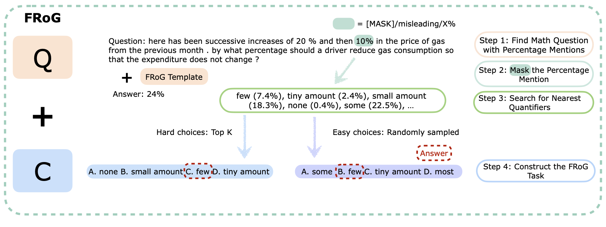

#  FRoG: Evaluating Fuzzy Reasoning of Generalized Quantifiers in Large Language Models

[[Paper]](https://arxiv.org/abs/2407.01046) [[Huggingface]](https://huggingface.co/datasets/GAIR/FRoG)

### FRoG Overview


### Sample Data
```
{
"id": 1,
"question": "john and ingrid pay [MASK] and 40 % tax annually , respectively . if john makes $ 60000 and ingrid makes $ 72000 , what is their combined tax rate ?\n\nIf the answer to the question is 35.6 %, then please select the quantifier that is closest to the meaning of [MASK] from the following choices.  A. moderate amount B. few C. small amount D. some",
"target_percentage_mention": "30 %",
"quantifier": "moderate amount",
"quantifier_strength_gap": 0.069,
"answer": "A",
"origin_question": "john and ingrid pay 30 % and 40 % tax annually , respectively . if john makes $ 60000 and ingrid makes $ 72000 , what is their combined tax rate ?",
"origin_reasoning": "\"( 1 ) when 30 and 40 has equal weight or weight = 1 / 2 , the answer would be 35 . ( 2 ) when 40 has larger weight than 30 , the answer would be in between 35 and 40 . unfortunately , we have 2 answer choices d and e that fit that condition so we need to narrow down our range . ( 3 ) get 72000 / 132000 = 6 / 11 . 6 / 11 is a little above 6 / 12 = 1 / 2 . thus , our answer is just a little above 35 . answer : d\"",
"raw_question": "john and ingrid pay [MASK] and 40 % tax annually , respectively . if john makes $ 60000 and ingrid makes $ 72000 , what is their combined tax rate ?\n\nIf the answer to the question is 35.6 %, then please select the quantifier that is closest to the meaning of [MASK] from the following choices.",
"source": "MathQA_test"
}
```
* id: question id
* question: the question corresponds to a FRoG task.
* target_percentage_mention: the target percentage mention that is masked in *question*.
* quantifier: the generalized quantifier that the *target_percentage_mention* maps to.
* quantifier_strength_gap: the average strength of *quantifier* - *target_percentage_mention*.
* answer: the answer to the *question*.
* origin_question: the original math word problem.
* origin_reasoning: the reasoning chain to solve the *origin_question*.
* raw_question: the *question* excluding choices.
* source: the source benchmark

### Load the Dataset
```python
from datasets import load_dataset

frog = load_dataset("GAIR/FRoG", TASK, SPLIT)
```
while *TASK* belongs to {mask_quant, mislead, X, mask_percent} and *SPLIT* belongs to {easy, hard}.

### Reference
```
@article{li2024frogevaluatingfuzzyreasoning,
      title={FRoG: Evaluating Fuzzy Reasoning of Generalized Quantifiers in Large Language Models}, 
      author={Yiyuan Li and Shichao Sun and Pengfei Liu},
      year={2024},
      eprint={2407.01046},
      archivePrefix={arXiv},
      primaryClass={cs.AI},
      url={https://arxiv.org/abs/2407.01046}, 
}
```